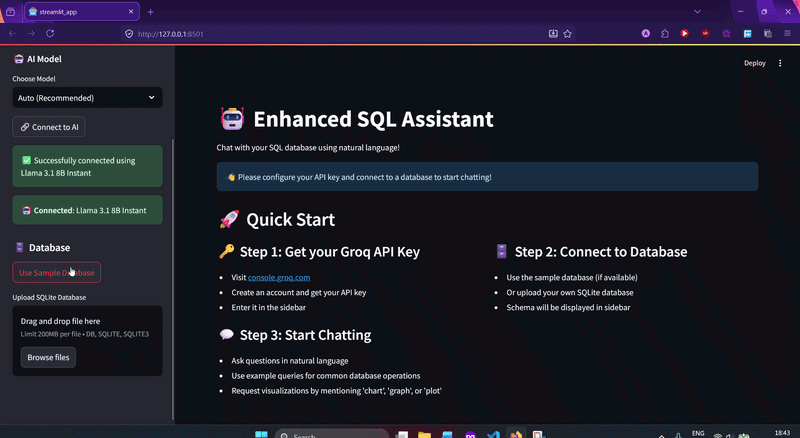

# 🤖 SQL Assistant

[](https://streamlit.io/)
[](https://python.org/)
[](https://langchain.com/)
[](https://groq.com/)

> **Chat with your databases in plain English**

An intelligent SQL interface powered by Groq's AI models and LangChain that converts natural language questions into SQL queries and visualizations.

---

## ✨ Features

- **🧠 AI-Powered**: Multiple Groq models with automatic fallback
- **💬 Natural Language**: Ask questions in plain English
- **📊 Smart Visualizations**: Auto-generated charts and graphs
- **🔒 Secure**: Read-only operations with SQL injection protection
- **🗄️ Database Support**: SQLite with more databases coming soon

---

## 🚀 Quick Start

### Prerequisites

- Python 3.8+
- Groq API key ([Get free here](https://console.groq.com/))

### Installation

```bash
# Clone & install
git clone https://github.com/YuvvrajSingh/sql-gpt.git
cd sql-gpt
pip install -r requirements.txt

# Set up environment
echo "GROQ_API_KEY=your_api_key_here" > .env

# Run the app
streamlit run streamlit_app.py
```

Your SQL Assistant will be available at `http://localhost:8501`

---

## 📖 Usage

1. **Enter your Groq API key** in the sidebar
2. **Choose a database** (sample included or upload your own SQLite file)
3. **Ask questions** like:
   - "Show me the top 5 customers by sales"
   - "Create a bar chart of monthly revenue"
   - "Which products haven't been ordered recently?"

---
## 📖 Demo



---
## 🎨 Visualizations

Request charts by mentioning keywords like:

- "show me a chart"
- "create a graph"
- "plot the data"

**Available chart types**: Bar, Pie, Line, Scatter, Histogram

---

## ⚙️ Configuration

### Environment Variables

```env
GROQ_API_KEY=your_groq_api_key_here
STREAMLIT_SERVER_PORT=8501
```

### AI Models Used

1. **Llama 3.1 70B Versatile** (primary)
2. **Llama 3.1 8B Instant** (fallback)
3. **Gemma 2 9B IT** (backup)

---

<div align="center">

### 🚀 Ready to chat with your databases?

[](https://share.streamlit.io/)


</div>
